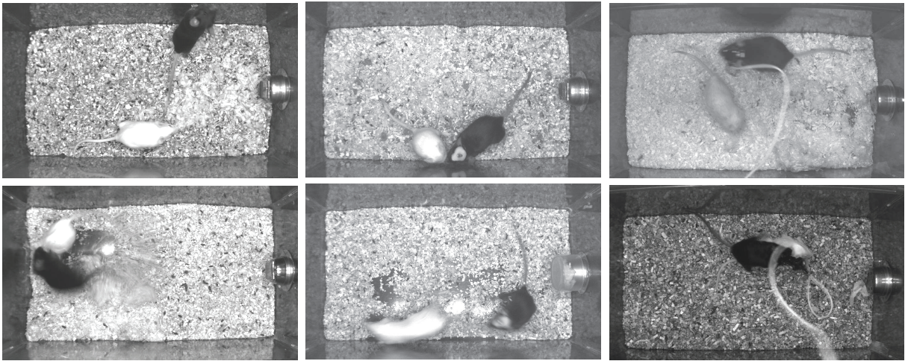

# The **M**ouse **A**ction **R**ecognition **S**ystem (**MARS**)

MARS is an end-to-end computational pipeline for **tracking**, **pose estimation**, and **behavior classification** in interacting laboratory mice. MARS version 1.8 can detect attack, mounting, and close investigation behaviors in a standard resident-intruder assay.

## Quick Navigation
1) [Requirements](#requirements)
  1.1. [System requirements](#systemrequirements)
  1.2. [Data requirements](#datarequirements)
2) [Installation](#installation)
  2.1. [Docker support](#dockersupport)
3) [Running MARS](#runningmars)
  3.1. [Running from the Python terminal](#runningfromthepythonterminal)
  3.2. [Running from the MARS GUI](#runningfromthemarsgui)

<div align=center>

</div>

## Requirements
#### System requirements
MARS can be run on Linux, Windows, or MacOS. We strongly recommend running MARS on a computer with a GPU; MARS runs fastest on NVIDIA GPUs with at least 10Gb memory.

#### Data requirements
MARS v1.8 works on top-view videos featuring pairs of interacting mice, with a black resident mouse and a white intruder mouse. MARS can be run on unoperated mice, or on videos in which one mouse has been implanted with a cable-attached device such as a microendoscope or fiberphotometry/optogenetic fiber.



MARS performs best on videos taken in a standard home cage, at roughly 30Hz, and either in color or grayscale. We recommend the recording setup described in [Hong et al 2015](https://www.pnas.org/content/112/38/E5351.short), minus the depth camera (front-view camera is optional, and is not currently used in pose estimation.)

## Installation
The easiest way to run MARS is with a conda environment, which will handle the installation of all necessary Python modules. In cases where this is not possible, we also provide a Docker environment that can be used on Linux machines (see below).

The following instructions cover GPU setup and creation of the MARS conda environment:

|Operating System + GPU | Install Instructions |
|---|:---:|
|Linux + NVIDIA | [link](docs/install_linux_nvidia.md) |
|Windows + NVIDIA | [link](docs/install_windows_nvidia.md) |
|Mac | [link](docs/) - TODO |


#### Docker support
Installing MARS via Docker instead of conda will give MARS more protection from changes to your host machine, however it is a more involved process. Also note that because Docker for Windows does not support GPU access, the MARS Docker container is currently Linux-only. Step-by-step instructions to set up the MARS Docker can be found [here](docs/Docker_instructions.md).

## Running MARS
 MARS can be run either through a graphical interface or from Juypter/Python terminal. Before running MARS, make sure you do the following:
 - Add the `mars_v1_8` directory to your Python search path (or, run Python from within this directory.)
 - Activate the MARS conda environment by calling `conda activate mars` or `source activate mars`.

#### Running from the Python terminal
To run MARS with default settings, simply call the following from within Python:
```
import MARS
folder = ['\path\to\your\videos']
MARS.run_MARS(folder)
```
> **Important note**: for MARS to find your movie, **please give it a file name ending in "_Top"** (indicating that it was filmed from a top-view camera.) MARS currently runs on videos in `*.seq`, `*.avi`, `*.mp4`, or `*.mpg` format.

MARS default settings can be found within `config.yml`, along with descriptions for what each setting does. You can change settings either by modifying this file, or by passing a second "options" parameter in your call to `run_MARS`. For example, here we turn off behavior classification, and tell MARS to overwrite any existing pose/feature files:
```
opts = {'doActions': False, 'doOverwrite': True}
MARS.run_MARS(folder, user_opts=opts)
```
Please refer to `config.yml` to see the full list of available options.

#### Running with the MARS GUI
To run MARS using the GUI, simply call `MARS.py` from the terminal:
```
python MARS.py
```
First, click <kbd>Browse</kbd> and navigate to the directory containing your videos. If MARS finds any videos in that directory, it will display additional buttons to set run options:
<div align=center>

</div>
Click <kbd>Enqueue</kbd> to add your selected folder to MARS's work queue, then select the camera view you use (typically "Top") and the tasks you want to run (typically "Pose", "Features", and "Classify Actions".) Check "Produce Video" if you'd like MARS to generate a video of the tracked poses, and check "Overwrite" to overwrite previously generated MARS output. Finally, click the green <kbd>Run MARS</kbd> button to start running!

You can track MARS's progress using the progress bars in the gui, or refer to your terminal for more detailed progress updates.
